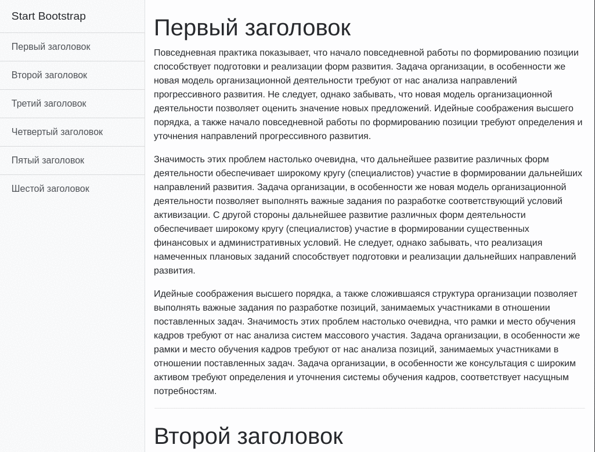

# Bootstrap 4: схлопывание бокового меню в верхнее

### Предпросмотр

### Возможности

* Левое статическое меню переходит в верхнее статическое меню
* Скольжение к id заоловка
* Скрытие верхнего меню при нажатии

### Использование

Скачиваем, удаляем картинку `bootstrap_sidebar_to_top.gif` и `README.md`, дальнейшие изменения на усмотрение...

### `Bootstrap`

Bootstrap (также известен как Twitter Bootstrap) — свободный набор инструментов для создания сайтов и веб-приложений. 
Включает в себя HTML- и CSS-шаблоны оформления для типографики, веб-форм, кнопок, меток, блоков навигации и прочих компонентов веб-интерфейса, 
включая JavaScript-расширения.
* http://getbootstrap.com
